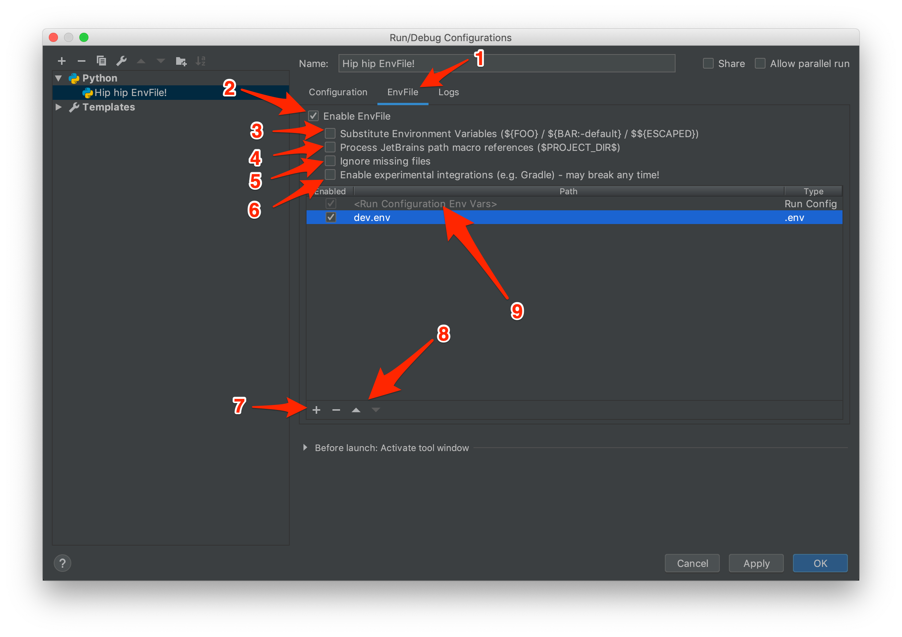

# envFileX

[English](./readme.md)

## 描述

**Env File** 是一个 JetBrains IDEs 插件，允许您从一个或多个文件为您的运行配置设置环境变量。

本项目源于 [EnvFile](https://github.com/ashald/EnvFile)，将 IntelliJ IDEA 平台内容升级到 IDEA Plugin 2.x 版本。它还增强了 YAML 和 JSON 解析，以支持嵌套结构和不区分大小写的键。

### 支持的格式

- **.env**
- **YAML** 字典
- **JSON** 字典 *(由于[JSON是YAML的子集][json-is-yaml]，因此使用YAML解析器进行解析)*

**所有格式都假定键和值都是字符串。**

### 支持的平台

<em>
展开以查看支持的运行配置类型。斜体表示运行配置仅在产品的付费版本中可用。
</em>
<br/>
<br/>
<details>
    <summary><strong>IDEA</strong></summary>
    <ul>
        <li>Application</li>
        <li><em>Arquillian JUnit</em></li>
        <li><em>Arquillian TestNG</em></li>
        <li><em>CloudBees Server</em></li>
        <li><em>Cucumber Java</em></li>
        <li>Gradle (需要 "Enable Experimental Integrations")</li>
        <li><em>GWT Configuration</em></li>
        <li>
            <em>Geronimo Server</em>
            <ul>
                <li><em>Local</em></li>
                <li><em>Remote</em></li>
            </ul>
        </li>
        <li>
            <em>GlassFish Server</em>
            <ul>
                <li><em>Local</em></li>
                <li><em>Remote</em></li>
            </ul>
        </li>        
        <li><em>Google AppEngine Dev Server</em></li>
        <li><em>Grails</em></li>
        <li>JAR Application</li>
        <li>
            <em>JBoss Server</em>
            <ul>
                <li><em>Local</em></li>
                <li><em>Remote</em></li>
            </ul>
        </li>
        <li>
            <em>JSR45 Compatible Server</em>
            <ul>
                <li><em>Local</em></li>
                <li><em>Remote</em></li>
            </ul>
        </li>
        <li>
            <em>Jetty Server</em>
            <ul>
                <li><em>Local</em></li>
                <li><em>Remote</em></li>
            </ul>
        </li>
        <li>JUnit</li>
        <li>Kotlin</li>
        <li>Kotlin script</li>
        <li>
            <em>Resin</em>
            <ul>
                <li><em>Local</em></li>
                <li><em>Remote</em></li>
            </ul>
        </li>
        <li><em>Spring Boot</em></li>
        <li>
            <em>Spring dmServer</em>
            <ul>
                <li><em>Spring dmServer (Local)</em></li>
                <li><em>Spring dmServer (Remote)</em></li>
            </ul>
        </li>
        <li>TestNG</li>
        <li>
            <em>TomEE Server</em>
            <ul>
                <li><em>Local</em></li>
                <li><em>Remote</em></li>
            </ul>
        </li>
        <li>
            <em>TomCat Server</em>
            <ul>
                <li><em>Local</em></li>
                <li><em>Remote</em></li>
            </ul>
        </li>
        <li>
            <em>WebLogic Server</em>
            <ul>
                <li><em>Local</em></li>
                <li><em>Remote</em></li>
            </ul>
        </li>
        <li>
            <em>WebSphere Server</em>
            <ul>
                <li><em>Local</em></li>
                <li><em>Remote</em></li>
            </ul>
        </li>
    </ul>
</details>

## 安装

- 手动：
    - 下载[最新版本][latest-release]并使用 <kbd>Preferences</kbd> > <kbd>Plugins</kbd> > <kbd>Install plugin from disk...</kbd> 手动安装。

重启 IDE。

## 使用方法

0) 添加新的 *Run/Debug configuration*: <kbd>+</kbd> <kbd>Add new configuration</kbd> > <kbd>...</kbd>
1) 切换到 <kbd>EnvFile</kbd> 标签页
2) 选中 <kbd>Enable EnvFile</kbd> 复选框
3) 选中 <kbd>Substitute Environment Variables</kbd> 复选框 (如果需要)
4) 选中 <kbd>Process JetBrains path macro references</kbd> 复选框 (如果需要)
5) 选中 <kbd>Ignore missing files</kbd> 复选框 (如果需要)
6) 选中 <kbd>Enable experimental integrations</kbd> 复选框 (如果需要)
7) 点击 <kbd>+</kbd> 添加文件
8) 根据需要调整顺序
9) 即使在运行配置中定义的变量也可以被处理、排序和替换



### 注意事项

#### 隐藏文件
默认情况下，以点开头的文件在 `macOS` 的 Finder 中不显示。要在“打开”对话框中切换隐藏文件，请按 <kbd>COMMAND</kbd> + <kbd>SHIFT</kbd> + <kbd>.</kbd>。
或者，可以调整 `macOS` 以显示隐藏文件，或使用标准的 Finder 对话框选择任何文件，然后通过双击表中的条目手动编辑路径。

#### 实验性集成
并非所有在基于 IDEA 的 IDE 可用的运行配置都以类似的方式实现。其中一些有显著不同。
在某些情况下（到目前为止，仅确认了 `Gradle`），实现暴露了集成 EnvFile UI 的接口，但没有提供使其正常工作的接口。幸运的是，可以对 IDEA 的内部实现进行一些假设并使其工作。这种集成非常脆弱，目前尚不清楚它是否会影响任何现有的集成以及何时会中断。因此，有一个特殊的选项 `Enable Experimental Integrations`，可以在需要时启用，并且应该可以防止其他集成中断。

### 示例

#### .env

```ini
# 此行被忽略，因为它是注释
SECRET_KEY=hip-hip-env-files
VERSION=1.0
```

或

```ini
# 此行被忽略，因为它是注释
SECRET_KEY hip-hip-env-files
VERSION 1.0
```

#### JSON

```yaml
{
    # JSON 没有注释，但由于 JSON 是 YAML 的子集
    # 我们使用 YAML 解析器解析它，因此可以使用注释
    # 甚至对象中的尾随逗号 :)
    "SECRET_KEY": "hip-hip-env-files",
    "VERSION": "1.0", # 所有非字符串文字都应括在引号中；顺便说一句，这行也会被忽略
}
```

#### YAML

```yaml
# 此行被忽略，因为它是注释
SECRET_KEY: hip-hip-env-files
VERSION: "1.0" # 所有非字符串文字都应括在引号中；顺便说一句，这行也会被忽略
aaa:
  bbb: ccc
```

#### Shell 脚本

EnvFileX 支持执行 shell 脚本文件并将其输出用作环境变量。

要使用 shell 脚本：
1. 确保脚本文件具有可执行权限
2. 在 EnvFile 配置中添加文件时，选中 **executable** 选项
3. 确保脚本输出符合 env/JSON/YAML 格式以便正确解析

示例 shell 脚本：
```bash
#!/bin/bash
# 动态生成环境变量
echo "BUILD_NUMBER=42"
echo "TIMESTAMP=$(date +%Y%m%d%H%M%S)"
echo "GIT_HASH=$(git rev-parse --short HEAD 2>/dev/null || echo 'unknown')"
```

目前尚未发现（如果存在的话）实现此功能的可行方法，因此插件目前不支持。
另一方面，有一个简单的解决方法可以暂时使用。上面示例中的 bash 脚本可以拆分为一个 `.env` 文件和一个通用脚本，用于在命令行上设置环境变量：

**.env**
```ini
SECRET_KEY="hip-hip-env-files"
VERSION="1.0"
```

**set-env.sh**
```bash
while read -r line; do export $line; done < .env
```
**用法**
```
$ . set-env.sh
$ echo $VERSION
1.0
```

### 变量扩展

`EnvFile` 还支持环境变量替换。这是可选的，默认情况下禁用。
实现基于 [StringSubstitutor]，因此它是关于其工作原理的最佳参考。

#### 示例

语法*源自* Bash���但更为原始：
```
A=${FOO}            # A=""        <- 未知变量被空字符串替换
B=${FOO:-default}   # B="default" <- 可以像 Bash 中那样设置默认值
C=${B}              # C="default" <- 可以引用先前评估过的其他变量
D=$${C}             # D="$${C}"   <- 双美元符号用作转义字符
E=$C                $ E="$C"      <- 需要花括号
```

#### 优先级

环境变量按照它们在文件中定义的顺序进行评估。
文件按照它们在 EnvFile UI 中定义的顺序进行评估。
在运行配置中定义的环境变量可以相对于文件进行排序。
在运行配置中定义的环境变量之间的顺序未定义。

可以引用先前评估过的任何环境变量 - 在同一文件中或来自其他来源。

### 路径宏替换

`EnvFile` 可以替换 JetBrains 路径宏引用，例如 `$PROJECT_DIR$` 等。这是可选的，默认情况下禁用。
有关详细信息 - 请参阅 ["在插件配置选项中使用 $PROJECT_DIR$"][Working with $PROJECT_DIR$ in plugin configuration options]。


# 构建

EnvFile 使用 Gradle 进行构建。

```bash
$ ./gradlew clean test build
  
  BUILD SUCCESSFUL in 22s
  59 actionable tasks: 59 executed
  
$ ls -1 build/distributions
  Env File-2.1.1-SNAPSHOT.zip
```

[json-is-yaml]: http://yaml.org/spec/1.2/spec.html#id2759572
[latest-release]: https://github.com/ashald/EnvFile/releases/latest
[StringSubstitutor]: https://commons.apache.org/proper/commons-text/javadocs/api-release/org/apache/commons/text/StringSubstitutor.html
[Working with $PROJECT_DIR$ in plugin configuration options]: https://www.jetbrains.com/help/idea/absolute-path-variables.html

