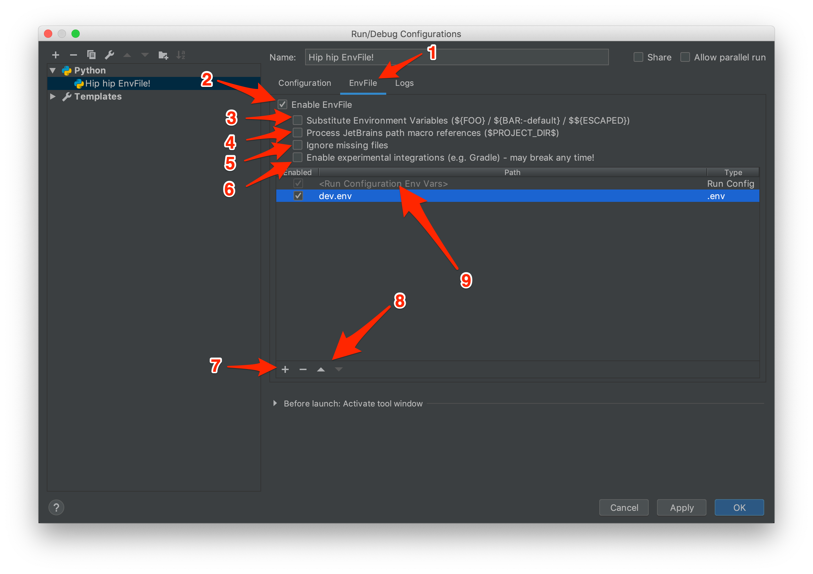

# envFileX

[中文](./readme-cn.md)

## Description

**Env File** is a plugin for JetBrains IDEs that allows you to set environment variables for your run configurations
from one or multiple files.

This project originated from [EnvFile](https://github.com/ashald/EnvFile), upgrading the IntelliJ IDEA platform content to IDEA Plugin 2.x version. It also enhances YAML and JSON parsing to support nested structures and case-insensitive keys.

### Supported Formats

- **.env**
- **YAML** dictionary
- **JSON** dictionary *(parsed with YAML parser since [JSON is subset of YAML][json-is-yaml])*

**All formats assume that both keys and values are strings.**

### Supported Platforms

<em>
Expand to see supported run configuration types. Italic means that run configuration is only available in paid
version of the product.
</em>
<br/>
<br/>
<details>
    <summary><strong>IDEA</strong></summary>
    <ul>
        <li>Application</li>
        <li><em>Arquillian JUnit</em></li>
        <li><em>Arquillian TestNG</em></li>
        <li><em>CloudBees Server</em></li>
        <li><em>Cucumber Java</em></li>
        <li>Gradle (requires "Enable Experimental Integrations")</li>
        <li><em>GWT Configuration</em></li>
        <li>
            <em>Geronimo Server</em>
            <ul>
                <li><em>Local</em></li>
                <li><em>Remote</em></li>
            </ul>
        </li>
        <li>
            <em>GlassFish Server</em>
            <ul>
                <li><em>Local</em></li>
                <li><em>Remote</em></li>
            </ul>
        </li>        
        <li><em>Google AppEngine Dev Server</em></li>
        <li><em>Grails</em></li>
        <li>JAR Application</li>
        <li>
            <em>JBoss Server</em>
            <ul>
                <li><em>Local</em></li>
                <li><em>Remote</em></li>
            </ul>
        </li>
        <li>
            <em>JSR45 Compatible Server</em>
            <ul>
                <li><em>Local</em></li>
                <li><em>Remote</em></li>
            </ul>
        </li>
        <li>
            <em>Jetty Server</em>
            <ul>
                <li><em>Local</em></li>
                <li><em>Remote</em></li>
            </ul>
        </li>
        <li>JUnit</li>
        <li>Kotlin</li>
        <li>Kotlin script</li>
        <li>
            <em>Resin</em>
            <ul>
                <li><em>Local</em></li>
                <li><em>Remote</em></li>
            </ul>
        </li>
        <li><em>Spring Boot</em></li>
        <li>
            <em>Spring dmServer</em>
            <ul>
                <li><em>Spring dmServer (Local)</em></li>
                <li><em>Spring dmServer (Remote)</em></li>
            </ul>
        </li>
        <li>TestNG</li>
        <li>
            <em>TomEE Server</em>
            <ul>
                <li><em>Local</em></li>
                <li><em>Remote</em></li>
            </ul>
        </li>
        <li>
            <em>TomCat Server</em>
            <ul>
                <li><em>Local</em></li>
                <li><em>Remote</em></li>
            </ul>
        </li>
        <li>
            <em>WebLogic Server</em>
            <ul>
                <li><em>Local</em></li>
                <li><em>Remote</em></li>
            </ul>
        </li>
        <li>
            <em>WebSphere Server</em>
            <ul>
                <li><em>Local</em></li>
                <li><em>Remote</em></li>
            </ul>
        </li>
    </ul>
</details>

## Installation

- Manually:
    - Download the [latest release][latest-release] and install it manually using <kbd>Preferences</kbd> >
      <kbd>Plugins</kbd> > <kbd>Install plugin from disk...</kbd>

Restart IDE.

## Usage

0) Add new *Run/Debug configuration*: <kbd>+</kbd> <kbd>Add new configuration</kbd> > <kbd>...</kbd>
1) Switch to <kbd>EnvFile</kbd> tab
2) Select <kbd>Enable EnvFile</kbd> checkbox
3) Select <kbd>Substitute Environment Variables</kbd> checkbox (if needed)
4) Select <kbd>Process JetBrains path macro references</kbd> checkbox (if needed)
5) Select <kbd>Ignore missing files</kbd> checkbox (if needed)
6) Select <kbd>Enable experimental integrations</kbd> checkbox (if needed)
7) Click on <kbd>+</kbd> to add a file
8) Adjust order as needed
6) Even variables defined within run configuration can be processed, ordered and substituted



### Caveats

#### Hidden files
Hidden files (starting with a dot) are not displayed in Finder on `macOS` by default. To toggle
hidden files in the Open dialog, press <kbd>COMMAND</kbd> + <kbd>SHIFT</kbd> + <kbd>.</kbd>.
Alternatively, one can either tweak `macOS` to show hidden files or select any file using
standard Finder dialog and then manually edit path by double-clicking on the entry in the table.

#### Experimental Integrations
Not all run configurations available in IDEA-based IDEs are implemented similarly. Some of them differ significantly.
In certain cases (so far, only `Gradle` has been confirmed) the implementation exposes interfaces to integrate the EnvFile UI
but doesn't provide interfaces for it to actually make its work. Luckily, it was possible to make few assumptions about
IDEA's internal implementation and make it work. Such integration is very fragile and it's not immediately clear if it
will affect any existing integrations and when it will break. For that reason there is a special option to
`Enable Experimental Integrations` that can be enabled when desired and should prevent other integrations from breaking.

### Examples

#### .env

```ini
# This line is ignored since it's a comment
SECRET_KEY=hip-hip-env-files
VERSION=1.0
```

or

```ini
# This line is ignored since it's a comment
SECRET_KEY hip-hip-env-files
VERSION 1.0
```

#### JSON

```yaml
{
    # JSON doesn't have comments but since JSON is subset of YAML
    # We parse it with YAML parser and therefore have comments
    # And even trialling commas in objects :)
    "SECRET_KEY": "hip-hip-env-files",
    "VERSION": "1.0", # All non-string literals should be enclosed in quotes; btw this is ignored too
}
```

#### YAML

```yaml
# This line is ignored since it's a comment
SECRET_KEY: hip-hip-env-files
VERSION: "1.0" # All non-string literals should be enclosed in quotes; btw this is ignored too
aaa:
  bbb: ccc
```

#### Shell Scripts

EnvFileX supports executing shell script files and using their output as environment variables. 

To use a shell script:
1. Make sure the script file has executable permissions
2. Check the **executable** option when adding the file to the EnvFile configuration
3. Ensure the script output conforms to env/JSON/YAML format for proper parsing

Example shell script:
```bash
#!/bin/bash
# Dynamic environment variables generation
echo "BUILD_NUMBER=42"
echo "TIMESTAMP=$(date +%Y%m%d%H%M%S)"
echo "GIT_HASH=$(git rev-parse --short HEAD 2>/dev/null || echo 'unknown')"
```

The feasible way to do that is yet to be discovered (if any at all) so the plugin does not support that at the moment.
On the other hand there is a simple workaround that can be used for the time being. The example bash script from above
can be split into an `.env` file and a generic script that can be used to set environment variables on a command line:

**.env**
```ini
SECRET_KEY="hip-hip-env-files"
VERSION="1.0"
```

**set-env.sh**
```bash
while read -r line; do export $line; done < .env
```
**usage**
```
$ . set-env.sh
$ echo $VERSION
1.0
```

### Variable Expansion

`EnvFile` also supports environment variable substitution. It's optional and disabled by default.
Implementation is based on [StringSubstitutor] so it's the best reference for how it works.

#### Examples

Syntax is *_derived_* from Bash but is way more primitive:
```
A=${FOO}            # A=""        <- unknown variables replaced by empty strings
B=${FOO:-default}   # B="default" <- default values can be set as in Bash
C=${B}              # C="default" <- it's possible to refer to other variables that were previously evaluated
D=$${C}             # D="$${C}"   <- double dollar serves as an escape character
E=$C                $ E="$C"      <- curly brackets are required
```

#### Precedence

Environment variables are evaluated in the order they are defined in files.
Files are evaluated in the order defined in EnvFile UI.
Environment variables defined in run configuration can be ordered relatively to files.
Order between environment variables defined in run configuration is not defined.

It is possible to refer to any environment variables that were evaluated previously - within same file or from other sources.

### Path Macro Substitution

`EnvFile` can substitute JetBrains path macro references such as `$PROJECT_DIR$` etc. It's optional and disabled by default.
For details - see ["Working with $PROJECT_DIR$ in plugin configuration options"][Working with $PROJECT_DIR$ in plugin configuration options].


# Building

EnvFile uses Gradle for building.

```bash
$ ./gradlew clean test build
  
  BUILD SUCCESSFUL in 22s
  59 actionable tasks: 59 executed
  
$ ls -1 build/distributions
  Env File-2.1.1-SNAPSHOT.zip
```

